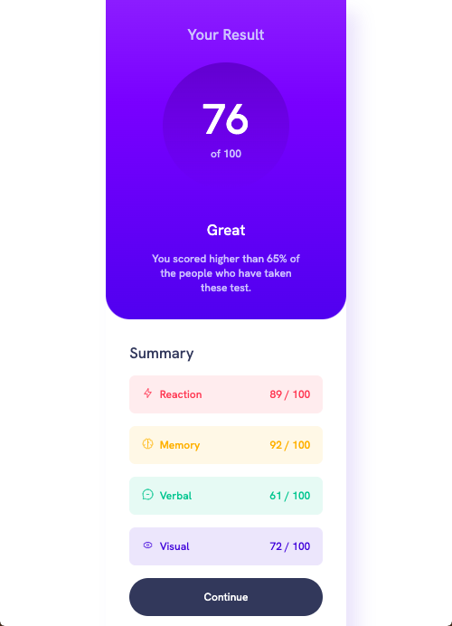

# Frontend Mentor - Results summary component solution

This is a solution to the [Results summary component challenge on Frontend Mentor](https://www.frontendmentor.io/challenges/results-summary-component-CE_K6s0maV). Frontend Mentor challenges help you improve your coding skills by building realistic projects. 

## Table of contents

- [Overview](#overview)
  - [The challenge](#the-challenge)
  - [Screenshot](#screenshot)
  - [Links](#links)
- [My process](#my-process)
  - [Built with](#built-with)
  - [What I learned](#what-i-learned)
  - [Continued development](#continued-development)
  - [Useful resources](#useful-resources)
- [Author](#author)
- [Acknowledgments](#acknowledgments)


## Overview


### The challenge

Users should be able to:

- View the optimal layout for the interface depending on their device's screen size
- See hover and focus states for all interactive elements on the page
- **Bonus**: Use the local JSON data to dynamically populate the content

### Screenshot





### Links

- Solution URL: [Add solution URL here](https://your-solution-url.com)
- Live Site URL: [Add live site URL here](https://your-live-site-url.com)

## My process

### Built with

- Semantic HTML5 markup
- CSS custom properties
- Flexbox
- CSS Grid


### What I learned

This is my second challenge in Front end mentor. It has helped me to reinforce the handling of variables in css, which results in a much more comfortable maintenance. In case any change of color or font or size, etc. is necessary, it is only a matter of modifying the variable in the globals section. 

```html
<h1>Some HTML code I'm proud of</h1>
```
```css
:root {

    /* Sizes*/
    --mobile: 375px;
    --desktop: 700px;


    /* Primary */
    --light-red-solid: hsl(0, 100%, 67%);
    --orangey-yellow-solid: hsl(39, 100%, 56%);
    --green-teal-solid: hsl(166, 100%, 37%);
    --cobalt-blue-solid: hsl(234, 85%, 45%);
    
    --light-red: hsla(0, 100%, 67%, .1);
    --orangey-yellow: hsla(39, 100%, 56%, .1);
    --green-teal: hsla(166, 100%, 37%, .1);
    --cobalt-blue: hsla(234, 85%, 45%, .1);
   
    /* Gradients */
    --light-slate-blue: hsl(252, 100%, 67%);
    --light-royal-blue: hsl(241, 81%, 54%);
        /* Background */
        --gradient-bg: linear-gradient(
            var(--light-slate-blue),
            var(--light-royal-blue));
    
    --violet-blue: hsla(256, 72%, 46%, 1); 
    --persian-blue: hsla(241, 72%, 46%, 0);   
        /* Circle */
        --gradient-cirlce: linear-gradient(
            var(--violet-blue),
            var(--persian-blue));
    
    /* Neutral */

    --white: hsl(0, 0%, 100%);
    --pale-blue: hsl(221, 100%, 96%);
    --light-lavender: hsl(241, 100%, 89%);
    --dark-gray-blue: hsl(224, 30%, 27%);

    /* Fonts */
    --ff-default: 'Hanken Grotesk', sans-serif;

    --fw-regular: 500;
    --fw-medium: 700;
    --fw-bold: 800;

    --fs-400: 1.125rem;
    --fs-500: 1.25rem;
    --fs-600: 1.5rem;
    --fs-700: 1.8rem;
    --fs-800: 2.5rem;
    --fs-900: 7rem;

}
```


I also learned how to make shapes, a circle in this case, using css code. I drew my circle as follows
```html

<p class="result__scoring">
            <span>76</span> of 100
          </p>
```


```css
.result__scoring {
    background: var(--gradient-cirlce);
    aspect-ratio: 1 / 1;
    border-radius: 50%;
    display: flex;
    flex-direction: column;
    justify-content: center;
    margin: auto;
    width: 66%;
    margin-top: 2rem;    
    margin-bottom: 2rem;    

}
```

### Continued development

I must practice more the concepts of margin, padding, border because I waste a lot of time looking for the correct spacing between the elements.

In the following challenges I will put SASS into practice.


## Author
JC Ló
- Frontend Mentor - [@jclomu](https://www.frontendmentor.io/profile/yourusername)

## Acknowledgments

I appreciate Kevin Powell's youtube video series. They give me a broad idea of ​​how to start my projects, which helps to make the workflow more optimal.

Youtube Link:
(https://www.youtube.com/watch?v=KqFAs5d3Yl8&t=936s) 
